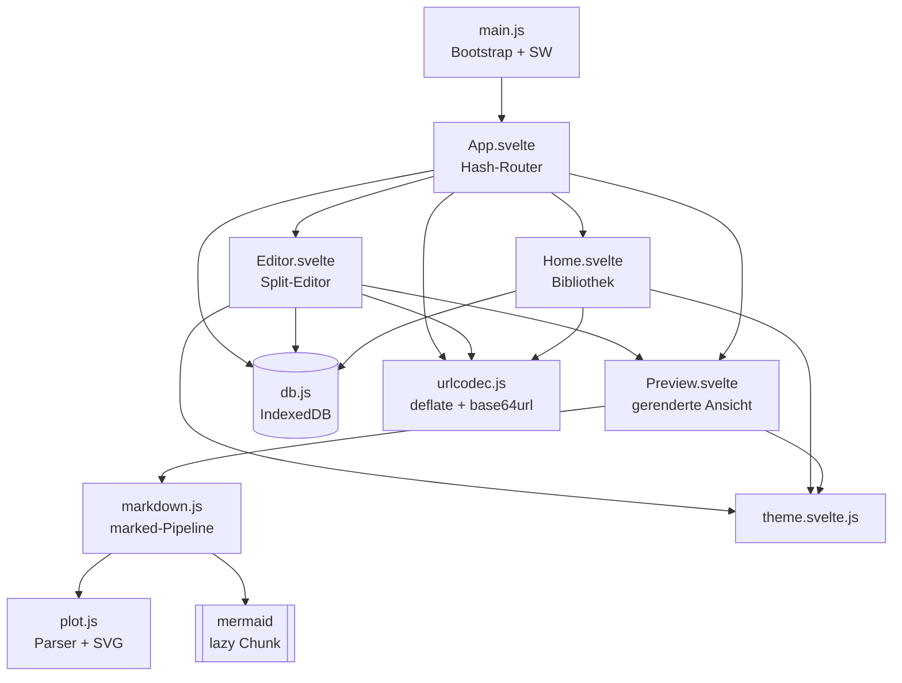
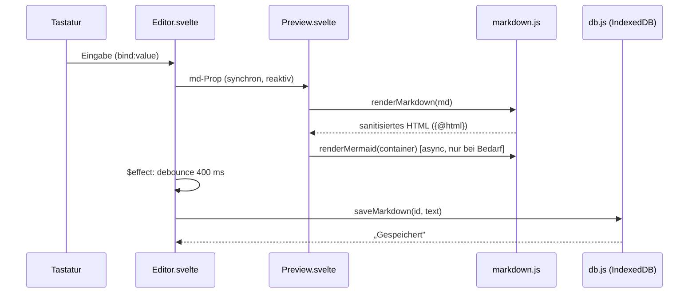
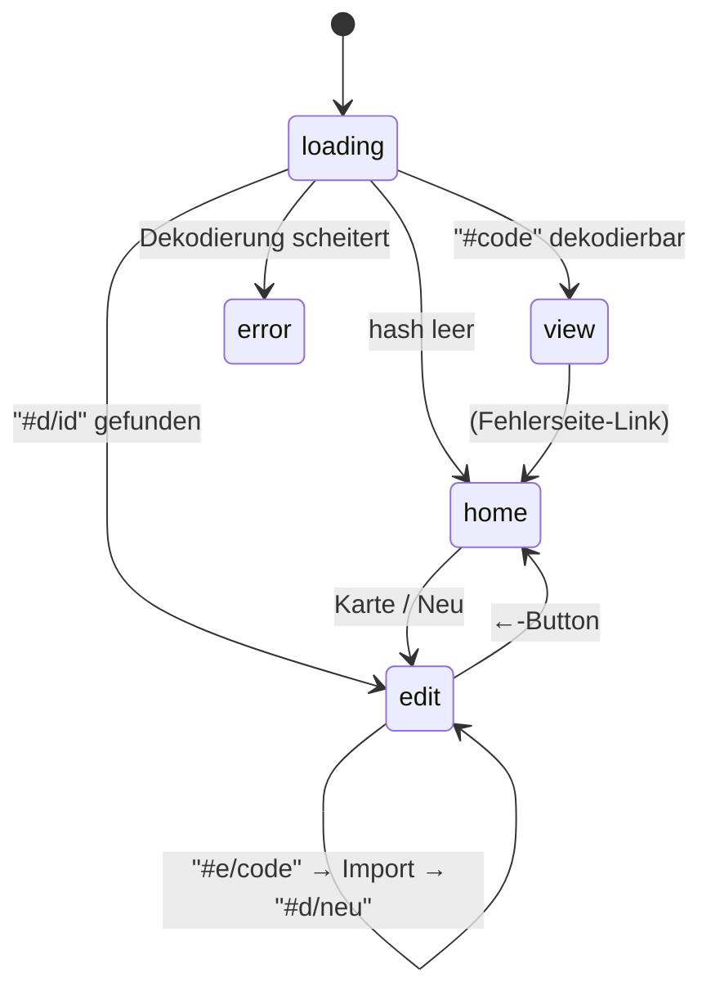

# Technische Analyse und Dokumentation — „Aufgabenblatt"

Stand: Juli 2026 · bezieht sich auf den Branch `claude/svelte-markdown-renderer-3ytvdh`

Diese Dokumentation beschreibt Architektur, Datenflüsse, Algorithmen,
Sicherheitsmodell, Performance-Eigenschaften und Grenzen der Anwendung im
Detail. Zielgruppe sind Entwickler:innen, die das Projekt warten, erweitern
oder auditieren wollen.

---

## Inhaltsverzeichnis

1. [Projektziel und Grundidee](#1-projektziel-und-grundidee)
2. [Technologie-Stack](#2-technologie-stack)
3. [Gesamtarchitektur](#3-gesamtarchitektur)
4. [Routing und Zustandsmodell](#4-routing-und-zustandsmodell)
5. [URL-Kodierung: Dokumente ohne Server teilen](#5-url-kodierung-dokumente-ohne-server-teilen)
6. [Lokale Persistenz: IndexedDB](#6-lokale-persistenz-indexeddb)
7. [Markdown-Rendering-Pipeline](#7-markdown-rendering-pipeline)
8. [Die Plot-Engine im Detail](#8-die-plot-engine-im-detail)
9. [Mermaid-Integration](#9-mermaid-integration)
10. [Theming: Light/Dark Mode](#10-theming-lightdark-mode)
11. [PWA: Installierbarkeit und Offline-Betrieb](#11-pwa-installierbarkeit-und-offline-betrieb)
12. [UI/UX-Entscheidungen](#12-uiux-entscheidungen)
13. [Sicherheitsmodell](#13-sicherheitsmodell)
14. [Performance-Analyse](#14-performance-analyse)
15. [Teststrategie](#15-teststrategie)
16. [Bekannte Grenzen](#16-bekannte-grenzen)
17. [Erweiterungsideen](#17-erweiterungsideen)

---

## 1. Projektziel und Grundidee

Lehrkräfte erstellen Arbeitsblätter als Markdown und teilen sie als Link mit
Schüler:innen — **ohne Server, ohne Datenbank, ohne Konten**. Daraus folgen
die zwei zentralen Architekturentscheidungen:

1. **Das geteilte Dokument ist die URL.** Der komplette Markdown-Quelltext
   wird komprimiert und URL-sicher kodiert in das Hash-Fragment geschrieben.
   Wer den Link hat, hat das Dokument; es existiert keine serverseitige
   Kopie, die gepflegt, gesichert oder gelöscht werden müsste.
2. **Die eigene Bibliothek liegt im Browser.** Alle selbst erstellten
   Blätter werden in IndexedDB gespeichert. Die App ist damit vollständig
   offline-fähig und als PWA installierbar; ein JSON-Export/-Import dient
   als Backup- und Umzugsmechanismus.

Der Build ist eine rein statische Seite (`dist/`), lauffähig auf jedem
statischen Hosting. Es gibt keinerlei Laufzeit-Abhängigkeit zu einem Backend;
die einzigen externen Ressourcen sind vom Autor eingebettete Online-Medien
(Bilder, YouTube/Vimeo).

---

## 2. Technologie-Stack

| Baustein | Version | Aufgabe | Warum diese Wahl |
| --- | --- | --- | --- |
| [Svelte](https://svelte.dev) | 5.x (Runes) | UI-Framework | Kompiliert zu schlankem Vanilla-JS, kein Virtual DOM; Runes (`$state`, `$derived`, `$effect`, `$props`) machen Reaktivität explizit |
| [Vite](https://vite.dev) | 8.x (Rolldown) | Build/Dev-Server | Schneller Dev-Server mit HMR, automatisches Code-Splitting dynamischer Importe |
| [marked](https://marked.js.org) | 18.x | Markdown → HTML | Klein, schnell, synchron nutzbar, sauberes Extension-API |
| [marked-katex-extension](https://github.com/UziTech/marked-katex-extension) | 5.x | `$…$`/`$$…$$`-Tokenizer | Bindet KaTeX korrekt in den marked-Tokenizer ein (statt fehleranfälligem Nachbearbeiten) |
| [KaTeX](https://katex.org) | 0.17 | Formelsatz | Synchrones, schnelles Rendering ohne Layout-Reflow (im Gegensatz zu MathJax) |
| [highlight.js](https://highlightjs.org) | 11.x (`lib/common`) | Syntax-Highlighting | `lib/common` bündelt nur die ~40 gängigsten Sprachen statt aller ~190 |
| [mermaid](https://mermaid.js.org) | 11.x | Diagramme | De-facto-Standard für Text-zu-Diagramm; wird lazy geladen (s. § 9) |
| [DOMPurify](https://github.com/cure53/DOMPurify) | 3.x | HTML-Sanitizing | Referenz-Sanitizer; zentral für das Sicherheitsmodell (s. § 13) |
| [vite-plugin-pwa](https://vite-pwa-org.netlify.app) | 1.x | Manifest + Service Worker | Generiert Workbox-Precache aus dem Build-Graphen |
| `CompressionStream` | nativ | Kompression | Browser-natives deflate-raw — **null Bytes** Bundle-Kosten für die Kernfunktion der App |

Bewusst **nicht** verwendet:

- **Kein Router-Framework** — das Routing besteht aus vier Hash-Präfixen
  (§ 4); eine Bibliothek wäre Overhead.
- **Kein `lz-string`/`pako`** — `CompressionStream('deflate-raw')` ist nativ,
  komprimiert besser als lz-string und kostet kein Bundle-Gewicht.
- **Kein `eval`/`new Function` für Plots** — eigener Parser (§ 8), damit aus
  geteilten Dokumenten niemals Code ausgeführt werden kann.
- **Keine UI-Bibliothek** — das Design-System sind ~40 CSS-Custom-Properties
  (§ 10), das genügt für den Umfang der App und hält den Stil konsistent.

### Quellcode-Umfang

| Datei | Zeilen | Verantwortung |
| --- | ---: | --- |
| `src/lib/plot.js` | 309 | Ausdrucksparser + SVG-Plotter |
| `src/lib/Home.svelte` | 145 | Startbildschirm (Liste, Suche, Export/Import) |
| `src/lib/markdown.js` | 127 | marked-Konfiguration, Sanitizing, Mermaid-Loader |
| `src/lib/db.js` | 104 | IndexedDB-Wrapper + Backup |
| `src/lib/Editor.svelte` | 98 | Editor mit Autosave und Toolbar |
| `src/App.svelte` | 67 | Hash-Routing |
| `src/lib/example.js` | 54 | Beispieldokument |
| `src/lib/urlcodec.js` | 40 | Kompression/Base64-URL |
| `src/lib/Preview.svelte` | 21 | Gerenderte Ansicht (wiederverwendet) |
| `src/lib/theme.svelte.js` | 21 | Theme-Store |
| `src/main.js` | 11 | Bootstrap, SW-Registrierung |
| **Summe** | **≈ 1000** | |

---

## 3. Gesamtarchitektur

### Modulgraph



### Schichten

1. **Präsentation** — vier Svelte-Komponenten. `Preview.svelte` ist die
   einzige Stelle, die `{@html}` verwendet, und erhält ausschließlich
   durch DOMPurify gelaufenes Markup.
2. **Domänenlogik** — reine ES-Module ohne Framework-Bezug (`urlcodec.js`,
   `db.js`, `plot.js`, `markdown.js`). Sie sind einzeln testbar und könnten
   unverändert in eine andere UI übernommen werden.
3. **Plattform** — Browser-APIs: IndexedDB, `CompressionStream`, Clipboard,
   File/Blob, Service Worker, `matchMedia`.

### Datenfluss beim Editieren



Die Vorschau aktualisiert **synchron bei jedem Tastendruck** (marked + KaTeX
+ Plot-Rendering sind für Dokumente in Arbeitsblattgröße im
Sub-Millisekunden- bis einstelligen Millisekundenbereich); nur die
persistierenden Seiteneffekte (IndexedDB-Write) sind debounced.

---

## 4. Routing und Zustandsmodell

Das gesamte Routing lebt im **Hash-Fragment**. Das hat drei Gründe:

1. Das Fragment wird **nie an einen Server gesendet** — wichtig, weil es das
   komplette Dokument enthält (Datenschutz, keine Server-Log-Spuren, keine
   Längenlimits von Proxies/Servern).
2. Statisches Hosting braucht keine Rewrite-Regeln (kein History-API-Routing).
3. Anker-Navigation und Browser-Verlauf funktionieren ohne Zusatzcode.

### Routentabelle

| Hash | Modus | Verhalten |
| --- | --- | --- |
| *(leer)* | `home` | Startbildschirm mit allen Arbeitsblättern |
| `#d/<id>` | `edit` | Editor; lädt das Blatt mit `<id>` aus IndexedDB. Existiert es nicht (z. B. anderes Gerät), Redirect auf `#` |
| `#e/<code>` | Import | Dekodiert `<code>`, legt ein **neues** Blatt in IndexedDB an und ersetzt die URL via `location.replace('#d/<id>')` (kein zusätzlicher Verlaufseintrag) |
| `#<code>` | `view` | Nur gerenderter Inhalt, keinerlei UI-Elemente — der Schüler-Link |
| *(ungültiger Code)* | `error` | Fehlerseite mit Link zur Übersicht |

Die Zustandsmaschine in `App.svelte`:



Implementierungsdetails:

- `readHash()` ist idempotent und wird initial sowie bei jedem
  `hashchange`-Event ausgeführt. Vor/Zurück im Browser funktioniert dadurch
  automatisch.
- Die Unterscheidung zwischen `#<code>` und den präfixierten Routen ist
  kollisionsfrei: Base64-URL enthält kein `/`, und die Präfixe `d/`, `e/`
  enden auf `/`.
- Der Editor wird per `{#key sheet.id}` neu instanziiert, wenn eine andere
  ID geladen wird — so kann kein Autosave-Timer eines alten Blatts in ein
  neues schreiben.

---

## 5. URL-Kodierung: Dokumente ohne Server teilen

Modul: `src/lib/urlcodec.js`

### Pipeline

```
Markdown (String)
  │ TextEncoder                 → UTF-8-Bytes
  │ CompressionStream('deflate-raw')  → komprimierte Bytes
  │ btoa + Zeichenersetzung     → Base64-URL ohne Padding
  ▼
URL-Fragment
```

Rückweg exakt spiegelbildlich mit `DecompressionStream('deflate-raw')`.

### Entwurfsentscheidungen

- **`deflate-raw` statt `gzip`/`deflate`:** spart 18 Bytes (gzip-Header +
  CRC) bzw. 6 Bytes (zlib-Header + Adler32) pro Link. Integrität sichert
  bereits die Base64-Dekodierung + Deflate-Struktur selbst: Manipulierte
  Links schlagen beim Dekodieren fehl und landen auf der Fehlerseite.
- **Base64-URL** (`+`→`-`, `/`→`_`, Padding entfernt) statt
  `encodeURIComponent` über Base64: Standard-Base64 in URLs müsste `+` und
  `/` prozent-kodieren, was Links um bis zu 3× Zeichen pro Sonderzeichen
  verlängert. Base64-URL ist im Fragment vollständig „URL-safe".
- **Chunked `String.fromCharCode`** (32-KiB-Blöcke) beim Byte→Binärstring-
  Umwandeln vermeidet „Maximum call stack size exceeded" bei großen
  Dokumenten (Spread über die Argumentliste ist stack-begrenzt).
- **Async-API:** `CompressionStream` ist Stream-basiert; die Funktionen sind
  `async`. Der einzige UI-relevante Aufrufer im Hot Path (Autosave) ist
  ohnehin debounced.

### Größenverhalten

Deflate nutzt Wiederholungen im Text; typische Arbeitsblätter (Aufgaben-
nummerierung, wiederkehrende LaTeX-Befehle) komprimieren sehr gut:

| Dokument | Markdown roh | Fragment (Base64-URL) | Quote |
| --- | ---: | ---: | ---: |
| Kurzes Blatt (2 Sätze + Formel) | ~60 B | ~50 Zeichen | ~0,8 |
| Beispieldokument (5 Aufgaben, Code, Mermaid, Plot, Video) | ~1,3 KiB | ~850 Zeichen | ~0,65 |
| Stark repetitiver Text (20× gleicher Absatz) | 1880 B | ~145 Zeichen | ~0,08 |

(Base64 kostet Faktor 4/3; die Netto-Kompression liegt für Prosa bei
~40–55 %, für repetitive Strukturen weit darunter.)

### Grenzen der URL-Länge

Es gibt kein hartes Standard-Limit, aber praktische:

| Kontext | sicheres Limit |
| --- | --- |
| Chrome/Firefox/Safari Adressleiste | > 64 k Zeichen (praktisch unkritisch) |
| WhatsApp/E-Mail-Clients (Link-Erkennung) | ~2–8 k Zeichen |
| QR-Code (Version 40, L) | ~4,3 k Zeichen |

Ein sehr umfangreiches Arbeitsblatt (mehrere Seiten Text) bleibt in der
Regel unter 3–4 k Zeichen und ist damit überall teilbar. Der „Link
teilen"-Toast zeigt die tatsächliche Länge an, damit die Lehrkraft ein
Gefühl dafür bekommt.

---

## 6. Lokale Persistenz: IndexedDB

Modul: `src/lib/db.js`

### Schema

- Datenbank `aufgabenblaetter`, Version 1, ein Object Store `sheets`
  mit `keyPath: 'id'`.
- Datensatz:

  ```js
  {
    id: string,        // Date.now().toString(36) + 4 Zufallszeichen
    markdown: string,  // kompletter Quelltext
    createdAt: number, // Unix-ms
    updatedAt: number, // Unix-ms — Sortierschlüssel der Übersicht
  }
  ```

Der Titel wird **nicht** redundant gespeichert, sondern bei Bedarf aus der
ersten Überschrift abgeleitet (`sheetTitle()`); damit gibt es keine
Konsistenzprobleme zwischen Titel und Inhalt.

### Wrapper-Design

IndexedDB ist Event-basiert; `db.js` kapselt das in zwei Primitive:

- `open()` — memoisiertes Promise auf die DB-Verbindung (einmaliges
  `onupgradeneeded` legt den Store an).
- `tx(mode, fn)` — führt `fn(store)` in einer Transaktion aus und löst beim
  `oncomplete` auf. Alle öffentlichen Funktionen (`listSheets`, `getSheet`,
  `putSheet`, `deleteSheet`, …) sind Einzeiler darüber.

Warum kein `idb`-Paket: der benötigte Ausschnitt (ein Store, fünf
Operationen) ist in ~40 Zeilen abgedeckt; eine Abhängigkeit lohnt nicht.

### Autosave-Semantik

`Editor.svelte` schreibt debounced (400 ms) nach jedem Tastendruck:

```js
$effect(() => {
  const text = markdown        // Abhängigkeit registrieren
  saved = false
  clearTimeout(saveTimer)
  saveTimer = setTimeout(async () => {
    await saveMarkdown(id, text)
    saved = true
  }, 400)
  return () => clearTimeout(saveTimer)
})
```

- Der Effekt-Cleanup räumt den Timer beim Unmount ab; durch `{#key sheet.id}`
  in `App.svelte` kann ein Timer nie in ein fremdes Blatt schreiben.
- `saveMarkdown` ist ein Read-Modify-Write (bewahrt `createdAt`);
  bei parallelen Tabs gilt Last-Writer-Wins pro Feld `markdown` —
  für den Anwendungsfall (eine Lehrkraft, ein Dokument) ausreichend.

### Backup (Export/Import)

- **Export:** `exportAll()` serialisiert alle Blätter als JSON-Datei
  `arbeitsblaetter-YYYY-MM-DD.json` mit Umschlag
  `{ app: 'aufgabenblatt', version: 1, exportedAt, sheets: [...] }`.
- **Import:** validiert den Umschlag (`app`-Kennung, `sheets`-Array) und
  jedes Element (String-`id`, String-`markdown`); Datensätze werden per
  `put` gemerged — gleiche IDs überschreiben, neue kommen hinzu. Fehlende
  Zeitstempel werden mit `Date.now()` aufgefüllt. Ungültige Dateien werfen
  eine verständliche Fehlermeldung in den Toast.

Das `version`-Feld erlaubt zukünftige Formatmigrationen.

---

## 7. Markdown-Rendering-Pipeline

Modul: `src/lib/markdown.js` — konfiguriert eine `Marked`-Instanz (keine
globale Mutation des Default-Parsers).

### Stufen

```
Quelltext
  │ 1. marked-katex-extension   Tokenizer: $…$, $$…$$ → KaTeX-HTML
  │ 2. marked-highlight          Codeblöcke → highlight.js-Spans
  │ 3. eigener code-Renderer     ```mermaid → <pre class="mermaid">…</pre>
  │                              ```plot    → fertiges SVG (plot.js)
  │ 4. eigener image-Renderer     →  | <iframe> | <video>
  │ 5. GFM-Standardrendering     Listen, Tabellen, Zitate, **fett**, …
  ▼ marked.parse(src, { async: false })
HTML (untrusted)
  │ 6. DOMPurify.sanitize(html, PURIFY_OPTS)
  ▼
HTML (trusted) → {@html} in Preview.svelte
```

Wichtige Konfigurationsdetails:

- **`gfm: true, breaks: true`** — GitHub-Dialekt; einfache Zeilenumbrüche
  werden zu `<br>`, was dem Erwartungsverhalten von Nicht-Programmierern
  beim Schreiben von Arbeitsblättern entspricht.
- **KaTeX** mit `throwOnError: false` (fehlerhafte Formeln erscheinen rot
  im Text statt das Rendering abzubrechen) und `nonStandard: true`
  (erlaubt `$x$` auch ohne umgebende Leerzeichen — verbreitete Schreibweise).
- **marked-highlight** überspringt `mermaid` (Stufe 3 übernimmt); unbekannte
  Sprachen fallen auf `plaintext` zurück, sodass nie eine Exception aus
  highlight.js das Rendering stoppt.

### Medien-Erweiterung (Stufe 4)

Die Standard-Bildsyntax wird zum universellen Einbettungsmechanismus
erweitert — bewusst **ohne neue Syntax**, damit Dokumente in anderen
Markdown-Viewern wenigstens als Link/Bild degradieren:

| `href` matcht | Ausgabe |
| --- | --- |
| `youtube.com/watch?v=…`, `youtu.be/…`, `/embed/`, `/shorts/` (11-Zeichen-ID) | `<iframe src="https://www.youtube-nocookie.com/embed/<id>">` in 16:9-Wrapper |
| `vimeo.com/<zahl>` | `<iframe src="https://player.vimeo.com/video/<id>">` |
| `*.mp4/webm/ogg` (auch mit `?query`/`#hash`) | `<video controls preload="metadata">` |
| alles andere | `` |

Die YouTube-Einbettung nutzt **youtube-nocookie.com** (keine
Tracking-Cookies vor dem Abspielen — relevant im Schulkontext), `loading="lazy"`
verzögert das Laden der iframes bis zur Sichtbarkeit.

### Warum Sanitizing nach dem Rendern?

Markdown erlaubt eingebettetes Roh-HTML. Da geteilte Dokumente aus fremden
URLs stammen können, ist der marked-Output grundsätzlich als unsicher zu
behandeln. DOMPurify läuft deshalb als letzte Stufe über das **komplette**
HTML — auch über das von KaTeX/plot.js erzeugte Markup (Verteidigung in der
Tiefe, s. § 13).

---

## 8. Die Plot-Engine im Detail

Modul: `src/lib/plot.js` (309 Zeilen, keine Abhängigkeiten)

### Eingabeformat

````markdown
```plot
f(x) = x^2 - 5x + 6
g(x) = 0.5x - 1
x: -1..7
y: -3..8
höhe: 300
```
````

Zeilenweise Grammatik (Reihenfolge egal, `//`/`#`-Kommentare erlaubt):

| Zeile | Bedeutung |
| --- | --- |
| `name(x) = ausdruck` | Funktionsdefinition; `name` erscheint in der Legende |
| `x: a..b` | Definitionsbereich (Pflichtangabe faktisch: Default −5..5) |
| `y: a..b` | Wertebereich; fehlt er → Auto-Skalierung (s. u.) |
| `höhe: n` / `height: n` | SVG-Höhe in px (120–800, Default 360) |

Nicht parsebare Zeilen erzeugen eine deutsche Fehlermeldung im Dokument
(`.plot-error`-Box) statt eines leeren Bereichs — wichtig beim Live-Tippen
im Editor.

### Ausdrucksparser (kein `eval`)

Drei klassische Phasen:

1. **Tokenizer** — Zahlen (`[0-9.]+`), Namen (`[a-zA-Z]+`), Operatoren
   `+ - * / ^ ( ) ,`. Unbekannte Zeichen → Fehler mit Zeichenangabe.
2. **Implizite Multiplikation** — ein Zwischenpass fügt `*`-Tokens ein, wo
   Schüler-/Lehrbuchnotation sie weglässt: `2x`, `5(x+1)`, `(x+1)(x-1)`,
   `x sin(x)`. Die Ausnahme: vor `(` nach einem Funktionsnamen (`sin(`)
   wird **kein** `*` eingefügt.
3. **Shunting-Yard → RPN** — Operator-Präzedenzen `+,- (1) < *,/ (2) <
   ^ (3) < neg (4)`; `^` und unäres Minus sind rechtsassoziativ, sodass
   `2^3^2 = 512` und `-x^2 = -(x^2)` — die mathematisch übliche Lesart.
   Unäres Minus wird kontextuell erkannt (am Ausdrucksanfang bzw. nach
   Operator/`(`/`,`) und als eigener `neg`-Operator kodiert.

`compileExpression()` gibt eine Closure `x => number` zurück, die den
RPN-Stack pro Aufruf auswertet. Erlaubte Namen sind ausschließlich:

- die Variable `x`,
- die Konstanten `pi`, `e`,
- die Whitelist-Funktionen `sin cos tan asin acos atan sqrt abs ln log
  (=log₁₀) exp floor ceil round sgn`.

Jeder andere Bezeichner wirft „Unbekannter Name" — es gibt **keinen** Pfad,
über den Dokumentinhalt als Code ausgeführt wird.

### Sampling und Auto-Skalierung

- Jede Funktion wird an **401 äquidistanten Stützstellen** über dem
  x-Bereich ausgewertet. Nicht-endliche Werte (`NaN`, `±Infinity`, z. B.
  `sqrt(x)` für x < 0, Polstellen von `1/x`) werden als Lücken markiert.
- Ohne `y:`-Angabe wird der Wertebereich robust geschätzt: alle endlichen
  Samples werden sortiert und auf das **2.–98. Perzentil** beschnitten,
  bevor 8 % Padding addiert werden. Das verhindert, dass eine einzelne
  Polstelle (etwa `1/x` nahe 0 mit Werten ±10⁶) den Plot auf eine
  unlesbare Skala zwingt.
- Degenerierte Fälle (konstante Funktion → Bereich der Breite 0, gar keine
  endlichen Werte) fallen auf sinnvolle Defaults zurück.

### SVG-Erzeugung

- Festes ViewBox-Koordinatensystem `0 0 560 H`, responsiv skaliert über
  CSS (`width: 100%; height: auto`), dadurch scharf auf jedem Display.
- **„Nice ticks":** Gitterschritt = kleinster Wert aus {1, 2, 2,5, 5, 10}
  · 10ⁿ, der den Bereich in ≤ 8 Intervalle teilt — liefert Beschriftungen
  wie 0,5/1/2/2,5 statt krummer Werte. Zahlen werden mit deutschem
  Dezimalkomma formatiert (`fmt()`).
- **Achsen durch den Ursprung**, wenn (0,0) im sichtbaren Bereich liegt,
  sonst an den Rand geklemmt — wie im Schulbuch.
- Pro Funktion ein `<path>`; der Stift wird bei Lücken abgesetzt
  (`M` statt `L`), Werte knapp außerhalb werden auf ±20 px über den Rand
  geklemmt und per `<clipPath>` (dokumentweit eindeutige ID, wichtig bei
  mehreren Plots pro Seite) beschnitten — so laufen steile Flanken sauber
  aus dem Bild statt hart abzureißen.
- **Theming über CSS-Klassen** (`plot-grid`, `plot-axis`, `plot-c1…c6`,
  `plot-label`, `plot-legend`) statt Inline-Farben: dieselbe SVG-Ausgabe
  ist in Light und Dark korrekt, ohne dass beim Theme-Wechsel neu
  gerendert werden müsste.
- Farb-Zuordnung zyklisch über 6 Slots; Legende oben rechts mit
  Funktionsnamen in der Kurvenfarbe.

Da die Ausgabe ein reiner SVG-String ist, läuft sie **synchron** in der
marked-Pipeline mit und funktioniert unverändert in der UI-losen
Schüler-Ansicht. DOMPurify lässt die verwendeten SVG-Elemente
(`svg, path, line, text, clipPath, rect, figure`) in der Default-Konfiguration
durch.

---

## 9. Mermaid-Integration

Mermaid ist mit Abstand die größte Abhängigkeit (≈ 100 gesplittete Chunks,
> 2 MiB). Deshalb:

1. **Lazy Loading:** `markdown.js` gibt für ` ```mermaid `-Blöcke nur
   `<pre class="mermaid">` mit escaptem Quelltext aus. Erst wenn
   `renderMermaid()` solche Knoten im gerenderten Container findet, wird
   `import('mermaid')` ausgelöst (memoisiertes Promise). Dokumente ohne
   Diagramme laden Mermaid **nie**.
2. **Theme-Kopplung:** `mermaid.initialize()` wird nur bei Theme-Wechsel
   erneut aufgerufen (`theme: 'dark' | 'default'`). Da Mermaid gerenderte
   Knoten via `data-processed` markiert und eine Re-Initialisierung
   bestehende SVGs nicht umfärbt, erzwingt `Preview.svelte` mit
   `{#key theme.current}` einen kompletten Remount des Containers — die
   `<pre class="mermaid">`-Knoten entstehen frisch und werden mit dem
   neuen Theme gerendert.
3. **Fehlerisolation:** `mermaid.run({ nodes })` ist in `try/catch`
   gekapselt; ein syntaktisch kaputtes Diagramm (Tippphase!) zeigt Mermaids
   Fehlermeldung im Block, der Rest des Dokuments bleibt intakt.
4. **`securityLevel: 'strict'`** — Mermaid escaped Labels und verbietet
   Klick-Interaktionen/Script-Injektion aus Diagrammtext.

---

## 10. Theming: Light/Dark Mode

### Token-Architektur

`app.css` definiert das gesamte Farbsystem als Custom Properties auf
`:root` (Light) und `:root[data-theme='dark']` (Dark):

- **Flächen:** `--bg`, `--bg-subtle`, `--bg-raised`
- **Text:** `--fg`, `--fg-muted`
- **Akzent/Status:** `--accent`, `--accent-hover`, `--on-accent`, `--danger`
- **Code-Token:** `--code-keyword`, `--code-string`, `--code-number`,
  `--code-comment`, `--code-title`
- **Plot:** `--plot-1…6`, `--plot-axis`, `--plot-grid`

Alle Komponenten-Styles referenzieren ausschließlich Tokens; es existiert
keine hartkodierte Farbe außerhalb der Token-Definitionen. `color-scheme`
wird mitgeschaltet, damit native Controls (Scrollbars, `<input type=search>`,
Datei-Dialoge) zum Theme passen.

### Kein hljs-Theme-Stylesheet

Statt `github.css`/`github-dark.css` (die sich nicht sauber parallel laden
lassen, weil beide dieselben `.hljs-*`-Selektoren setzen) definiert
`app.css` ~10 eigene Regeln, die die hljs-Klassen auf die Code-Tokens
mappen. Vorteile: ein einziges Stylesheet, sofortiger Wechsel ohne
Stylesheet-Tausch, konsistente Farbwelt mit dem Rest der App.

### Initialisierung ohne Flackern (FOUC)

Ein Inline-`<script>` im `<head>` von `index.html` setzt
`document.documentElement.dataset.theme` **vor dem ersten Paint**:
gespeicherte Wahl aus `localStorage`, sonst `prefers-color-scheme`. Der
Svelte-Store (`theme.svelte.js`, ein `$state`-Objekt) übernimmt danach die
Laufzeit-Umschaltung und persistiert Änderungen. `<meta name="theme-color">`
ist doppelt mit `media`-Query hinterlegt, damit die Browser-Chrome-Farbe
(installierte PWA!) zum Systemmodus passt.

### Reaktive Abhängigkeiten

`theme` ist ein Svelte-5-`$state`-Export; `Preview.svelte`, `Home.svelte`
und `Editor.svelte` lesen `theme.current` in Templates/Effekten und
reagieren dadurch automatisch. KaTeX braucht keine Sonderbehandlung
(erbt `currentColor`), Plots wechseln über CSS-Variablen, Mermaid über den
Remount (§ 9).

---

## 11. PWA: Installierbarkeit und Offline-Betrieb

Konfiguration in `vite.config.js` via `vite-plugin-pwa`:

- **Manifest:** Name „Aufgabenblatt", `display: standalone`, `lang: de`,
  `start_url: './'` und `scope: './'` (relativ — funktioniert unter
  beliebigen Unterpfaden wie GitHub Pages), Theme-Farbe `#2563eb`.
- **Icons:** `icon.svg` (Quelle, im Repo), daraus generierte
  `icon-192.png`, `icon-512.png` sowie `icon-512-maskable.png`
  (Motiv in der 80-%-Safe-Zone für Androids adaptive Icons). Zusätzlich
  `apple-touch-icon` in `index.html` für iOS-Homescreen.
- **Service Worker:** `generateSW`-Modus (Workbox). Precache über
  `globPatterns: ['**/*.{js,css,html,svg,png,woff2}']` — der komplette
  Build inkl. aller lazy Mermaid-Chunks und KaTeX-woff2-Fonts
  (131 Einträge, ≈ 4,1 MiB) wird beim ersten Besuch im Hintergrund
  gecacht. Danach ist die App **vollständig offline** nutzbar, auch das
  erstmalige Rendern eines Mermaid-Diagramms offline funktioniert.
- **Update-Strategie:** `registerType: 'autoUpdate'` +
  `registerSW({ immediate: true })` in `main.js`: neue Versionen werden
  beim nächsten Laden automatisch aktiviert; es gibt bewusst keinen
  „Update verfügbar"-Dialog (die App hat keinen serverseitigen Zustand,
  ein transparentes Update ist risikofrei).
- **TTF/WOFF(1) ausgeschlossen:** KaTeX liefert Fonts dreifach aus; nur
  `woff2` wird gecacht — alle relevanten Browser (Baseline 2026) nutzen
  ausschließlich woff2, das spart ~1,5 MiB Cache.

Offline-Datenmodell: Da Dokumente in IndexedDB bzw. in der URL leben, ist
Offline-Betrieb trivial konsistent — es gibt schlicht keine Serverdaten,
die stale werden könnten. Grenze: Ein `#<code>`-Link, der offline geöffnet
wird, funktioniert, sobald die App-Shell einmal gecacht wurde; eingebettete
Online-Medien (YouTube, Bilder) benötigen naturgemäß Netz.

---

## 12. UI/UX-Entscheidungen

Leitlinien: Material Design 3 und Apple Human Interface Guidelines,
reduziert auf ein minimalistisches, produktives Werkzeug.

- **Touch-Ziele ≥ 44 px** (HIG-Minimum; M3 empfiehlt 48 dp — Buttons sind
  44–48 px hoch): alle Buttons, Suchfeld 48 px.
- **Responsive-Strategie nach Inhalt, nicht Gerät:**
  - ≥ 56 rem (~900 px, Tablet quer / Desktop): Split-View Editor|Vorschau.
  - < 56 rem (Tablet hochkant / Smartphone): **Segmented Control**
    „Bearbeiten / Vorschau" statt gestapelter Halbfenster — zwei halbe
    Ansichten übereinander wären auf Tablets unproduktiv (zu wenig Zeilen
    Kontext in beiden). Das Umschalt-Muster entspricht M3-Tabs/HIG-Segmented
    Controls.
- **Safe Areas:** `viewport-fit=cover` + `env(safe-area-inset-*)` an
  Toolbar und Toast — korrekt auf iPads/iPhones mit Rundungen/Notch,
  besonders im installierten Standalone-Modus.
- **`100dvh`** statt `100vh` für das Editor-Layout: berücksichtigt die
  dynamische Browser-Chrome auf Mobilgeräten (URL-Leiste), verhindert
  abgeschnittene Toolbars.
- **Zustands-Transparenz:** Autosave-Status („Speichert … / Gespeichert")
  ist permanent sichtbar; destruktive Aktionen (Löschen) fordern
  Bestätigung mit Dokumenttitel; Feedback (Link kopiert + Länge) als
  vergänglicher Toast unten zentriert.
- **Startbildschirm als Karten-Grid** (`auto-fill, minmax(17rem, 1fr)`):
  skaliert von 1 Spalte (Phone) bis 3–4 Spalten (Desktop) ohne
  Media-Queries; Karten zeigen Titel, bereinigten Textauszug und
  Änderungsdatum (`Intl.DateTimeFormat('de-DE')`).
- **Leere Zustände** sind gestaltet (Erstes Blatt erstellen / Beispiel
  ansehen; „Nichts gefunden für …") — kein weißes Nichts.
- **Schüler-Ansicht ist radikal leer:** nur der gerenderte Inhalt in einer
  Lesespalte (`max-width: 52rem`), null App-Chrome. Der Link *ist* das
  Arbeitsblatt.
- **A11y-Grundlagen:** semantische Elemente (`header`, `main`, `time`,
  `figure`), `role="tablist"/"tab"` + `aria-selected` am Umschalter,
  `aria-label` an Icon-Buttons, sichtbarer Fokusrahmen der Plattform bleibt
  erhalten, Emoji-Icons sind durch `aria-label`/`title` benannt.

---

## 13. Sicherheitsmodell

### Bedrohungsmodell

Der relevante Angriffsvektor: **ein präpariertes Dokument in einem geteilten
Link** (`#<code>` / `#e/<code>`). Wer so einen Link öffnet, rendert fremdes
Markdown — das darf unter keinen Umständen Script-Ausführung, Datenzugriff
oder UI-Spoofing im Origin der App ermöglichen.

### Verteidigungslinien

1. **DOMPurify über dem gesamten HTML** (letzte Pipeline-Stufe, § 7).
   Erweiterungen gegenüber der Default-Konfiguration sind minimal und
   explizit:
   - `ADD_TAGS: ['iframe', 'video']`, `ADD_ATTR: ['allow',
     'allowfullscreen', 'frameborder', 'loading', 'controls', 'preload']`.
   - Ein `uponSanitizeElement`-Hook entfernt jedes `<iframe>`, dessen `src`
     nicht mit `https://www.youtube-nocookie.com/embed/` oder
     `https://player.vimeo.com/video/` **beginnt** (`startsWith`, kein
     Regex — keine Bypass-Tricks über Regex-Anker). Roh-HTML-iframes zu
     beliebigen Seiten sind damit ausgeschlossen.
   - `javascript:`-URLs, Event-Handler-Attribute, `<script>` etc. entfernt
     DOMPurify per Default.
2. **Kein `eval`-Pfad:** Die Plot-Engine interpretiert Ausdrücke über einen
   Whitelist-Parser (§ 8); Mermaid läuft mit `securityLevel: 'strict'`.
3. **Kein Server, keine Cookies, keine Tokens:** Es gibt nichts zu stehlen —
   das Schlimmste, was ein bösartiges Dokument erreichen könnte, wäre
   Zugriff auf die IndexedDB-Bibliothek *des Betrachters*, und dazu bräuchte
   es Script-Ausführung, die Linie 1 unterbindet.
4. **Import ist explizit:** `#e/<code>` legt zwar automatisch ein neues
   Blatt an, überschreibt aber nie existierende (frische ID); der
   JSON-Import validiert Struktur und Feldtypen.
5. **Medien-Privacy:** YouTube ausschließlich über `youtube-nocookie.com`;
   iframes erhalten eine enge `allow`-Liste statt Vollzugriff.

### Bewusste Rest-Risiken

- Eingebettete Bilder/Videos laden von fremden Servern → deren Betreiber
  sehen IP/User-Agent der Betrachter (inhärent bei Online-Medien; der Autor
  entscheidet, was er einbettet).
- `blob:`-Download und Clipboard-API laufen nur auf Nutzeraktion (Klick).
- Kein CSP-Header gesetzt (statisches Hosting ohne Header-Kontrolle wäre
  darauf nicht überall durchsetzbar); eine `Content-Security-Policy` via
  Meta-Tag wäre eine sinnvolle Härtungs-Erweiterung (§ 17).

---

## 14. Performance-Analyse

### Bundle (Produktions-Build, Vite 8/Rolldown)

| Artefakt | Größe | gzip | Ladezeitpunkt |
| --- | ---: | ---: | --- |
| `index-*.js` (App + marked + KaTeX + hljs/common + DOMPurify) | ~543 kB | ~170 kB | initial |
| `index-*.css` (App + KaTeX-CSS) | ~37 kB | ~10 kB | initial |
| KaTeX-Fonts (woff2, nur bei Formelnutzung angefordert) | ~28 kB/Font | — | on demand |
| Mermaid (≈ 100 Chunks, größter ~663 kB) | > 2 MiB | — | **nur bei ` ```mermaid `** |

Entscheidend: Der Mermaid-Koloss hängt am dynamischen `import()` und
belastet weder Erstladung noch Dokumente ohne Diagramme. Die frühere
Vollversion von highlight.js (~1 MB) wurde durch `highlight.js/lib/common`
ersetzt (−760 kB im Hauptbundle).

### Laufzeit

- **Rendering-Hot-Path** (jeder Tastendruck): `marked.parse` + KaTeX +
  Plot-Sampling sind synchron; für arbeitsblattgroße Dokumente (< 10 KiB)
  liegt ein kompletter Durchlauf im niedrigen Millisekundenbereich. Svelte
  ersetzt per `{@html}` nur den Container-Inhalt.
- **Plot-Sampling:** 401 Auswertungen × Funktionen pro Rendering; die
  kompilierte RPN-Closure vermeidet Re-Parsing pro Stützstelle.
- **Debouncing:** IndexedDB-Writes (400 ms) — I/O ist vom Tipp-Pfad
  entkoppelt. Mermaid rendert asynchron nach dem DOM-Update.
- **`loading="lazy"`** auf Bildern und iframes verhindert, dass ein
  medienreiches Arbeitsblatt beim Öffnen alle Videos anfragt.

### Skalierungsgrenzen

- Sehr große Dokumente (≫ 100 KiB) würden den synchronen Re-Render pro
  Tastendruck spürbar machen; Gegenmittel wäre ein debouncetes Preview
  (bewusst nicht eingebaut, da Arbeitsblätter klein sind und die sofortige
  Vorschau UX-wertvoller ist).
- IndexedDB skaliert auf tausende Blätter; die Volltextsuche ist ein
  linearer `includes`-Scan über alle Dokumente im Speicher — bei
  realistischen Bibliotheksgrößen (< 1000 Blätter × wenige KiB) unkritisch.

---

## 15. Teststrategie

Es gibt keine Unit-Test-Suite im Repo; die Absicherung erfolgt über einen
**End-to-End-Test mit Playwright** gegen den Produktions-Build
(`vite preview`), der bei der Entwicklung dieser Version vollständig grün
lief. Abgedeckte Pfade:

1. Startbildschirm: Leerzustand, Kartenliste, Titelableitung
2. Beispiel anlegen → Editor-Route `#d/<id>`
3. Rendering-Features in der Vorschau: KaTeX inline + display,
   hljs-Codeblock, Mermaid-SVG, **Plot-SVG mit 2 Kurven + Legende**,
   YouTube-iframe, Blockquote, Listen, fett/kursiv
4. Autosave → Übersicht zeigt Karte; **Reload stellt Inhalt aus IndexedDB
   wieder her**
5. Volltextsuche (Treffer + Leerzustand bei Nichttreffer)
6. „Link teilen" → Clipboard-Inhalt → geteilte Ansicht **ohne jegliche
   UI-Elemente**, KaTeX gerendert; Kurzdokument-Link ~79 Zeichen
7. `#e/<code>`-Import → Redirect auf neues `#d/<id>`
8. Theme-Toggle inkl. **Persistenz über Reload**
9. „Alle exportieren" → JSON-Download mit korrektem Umschlag und
   Blattanzahl
10. PWA: Manifest-Link im DOM, **Service Worker registriert**
11. Schmaler Viewport (700 px): Segmented Control sichtbar,
    Bearbeiten/Vorschau exklusiv umschaltbar
12. Fehlerpfad: nicht dekodierbarer Hash → Fehlerseite mit Ausweg
13. Null Konsolen-/Page-Errors über alle Szenarien

Empfehlung für die Weiterentwicklung: `plot.js` (Parser!) und `urlcodec.js`
sind pure Funktionen und ideale Kandidaten für Vitest-Unit-Tests
(Round-Trip-Property: `decode(encode(s)) === s`; Parser-Tabellen für
Präzedenz/implizite Multiplikation/Fehlerfälle).

---

## 16. Bekannte Grenzen

| Grenze | Einordnung |
| --- | --- |
| **Geräte-Bindung der Bibliothek:** IndexedDB ist pro Browser-Profil; kein Sync zwischen Geräten. | By design (keine Datenbank). Workaround: JSON-Export/-Import. |
| **„Website-Daten löschen" löscht die Bibliothek.** | Browser-Realität; Backup-Export ist der Schutz. `navigator.storage.persist()` wäre eine sinnvolle Ergänzung. |
| **Geteilte Links sind Schnappschüsse.** Nachträgliche Änderungen erfordern einen neuen Link. | Konsequenz des URL-als-Dokument-Modells; für Aufgabenblätter meist erwünscht (Versionsstand fixiert). |
| **Keine Kollaboration/gleichzeitiges Editieren.** | Außerhalb des Zielbilds. |
| **Editor ist eine `<textarea>`** — kein Markdown-Highlighting im Quelltext, keine Toolbar für Formatierung. | Bewusst minimal; CodeMirror 6 wäre der natürliche Ausbaupfad. |
| **Plot-Engine:** nur explizite Funktionen `y = f(x)`; keine Parameterkurven, Punktmengen, Ungleichungen, Asymptoten-Erkennung. Perzentil-Clipping kann bei exotischen Funktionen sichtbare Bereiche verschieben. | Für Sek-I/II-Standardfälle ausreichend; Format ist erweiterbar. |
| **URL-Länge** bei sehr großen Dokumenten (mehrseitig, viele Formeln) kann Messenger-Limits übersteigen. | Toast zeigt Länge; notfalls `.md`-Datei teilen. |
| **`confirm()`/Emoji-Icons** statt eigener Dialoge/Icon-Set. | Pragmatismus; austauschbar ohne Architekturänderung. |
| **Suche ist Substring-basiert**, keine Fuzzy-/Ranking-Suche. | Bei Bibliotheksgrößen im Hundert-Bereich unkritisch. |

---

## 17. Erweiterungsideen

Geordnet nach Aufwand/Nutzen:

1. **`navigator.storage.persist()`** beim ersten Speichern anfordern —
   schützt die Bibliothek vor automatischer Browser-Bereinigung (1 Zeile).
2. **Vitest-Unit-Tests** für `plot.js`/`urlcodec.js`/`db.js` (s. § 15).
3. **Druck-Stylesheet** (`@media print`): Arbeitsblätter direkt aus der
   View-Ansicht sauber ausdrucken (Seitenumbrüche, keine Video-Platzhalter).
4. **CSP per Meta-Tag** als zusätzliche Härtungsschicht (§ 13).
5. **CodeMirror 6** als Editor: Markdown-Syntaxfärbung, Zeilennummern,
   Formatierungs-Shortcuts (Cmd/Ctrl+B → `**…**`).
6. **QR-Code-Generierung** für den Schüler-Link (Beamer/Tafel-Workflow).
7. **Duplizieren & Vorlagen** auf dem Startbildschirm.
8. **Web Share API** (`navigator.share`) auf Tablets statt/neben Clipboard.
9. **Plot-Erweiterungen:** Punktlisten (`punkte: (1|2) (3|4)`),
   schraffierte Bereiche, zweite Variable für Scharen.
10. **GitHub-Pages-Workflow** (`deploy.yml`): Build + Publish bei Push —
    die App ist dank `base: './'` und relativer PWA-Pfade dafür vorbereitet.

---

*Ende der Dokumentation.*
